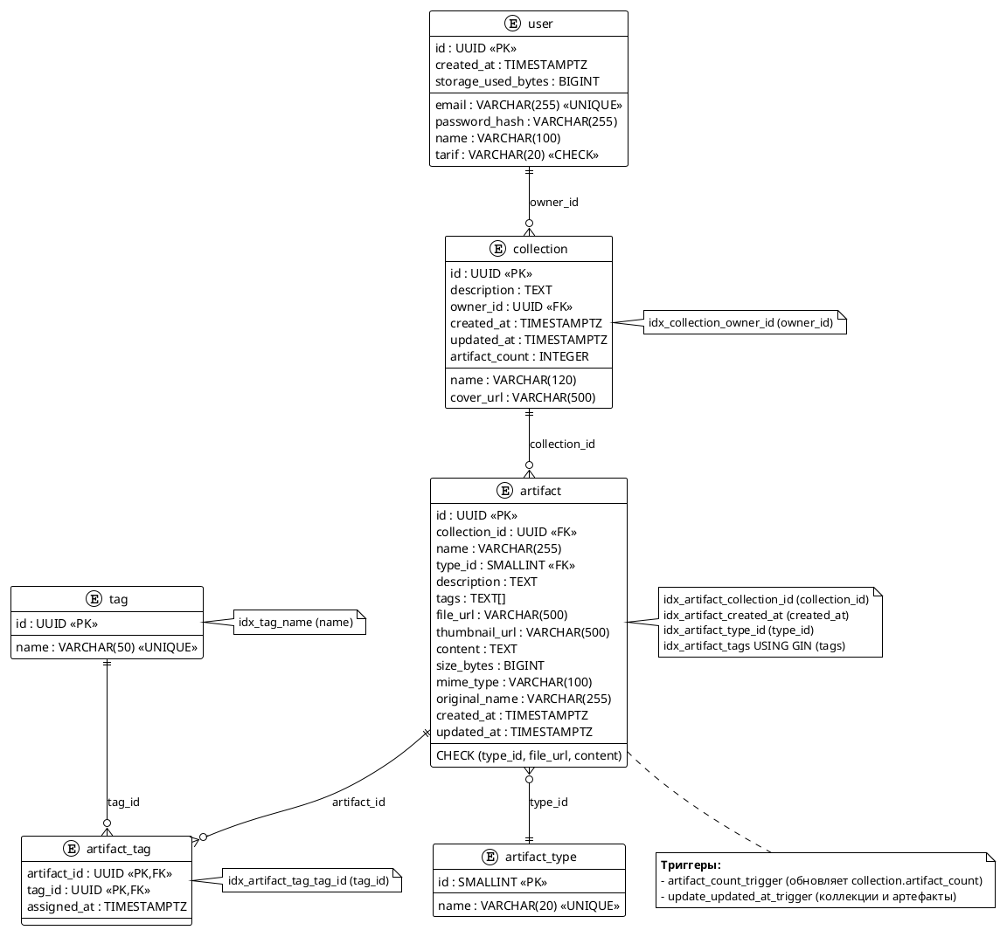

# Модель данных

## Концептуальная модель

## Логическая модель

## Физическая модель (PostgreSQL)

### PlantUML диаграмма

```plantuml
@startuml
!theme plain

entity "artifact_type" {
  id : SMALLINT <<PK>>
  name : VARCHAR(20) <<UNIQUE>>
}

entity "user" {
  id : UUID <<PK>>
  email : VARCHAR(255) <<UNIQUE>>
  password_hash : VARCHAR(255)
  name : VARCHAR(100)
  created_at : TIMESTAMPTZ
  storage_used_bytes : BIGINT
  tarif : VARCHAR(20) <<CHECK>>
}

entity "collection" {
  id : UUID <<PK>>
  name : VARCHAR(120)
  description : TEXT
  cover_url : VARCHAR(500)
  owner_id : UUID <<FK>>
  created_at : TIMESTAMPTZ
  updated_at : TIMESTAMPTZ
  artifact_count : INTEGER
}

entity "artifact" {
  id : UUID <<PK>>
  collection_id : UUID <<FK>>
  name : VARCHAR(255)
  type_id : SMALLINT <<FK>>
  description : TEXT
  tags : TEXT[]
  file_url : VARCHAR(500)
  thumbnail_url : VARCHAR(500)
  content : TEXT
  size_bytes : BIGINT
  mime_type : VARCHAR(100)
  original_name : VARCHAR(255)
  created_at : TIMESTAMPTZ
  updated_at : TIMESTAMPTZ
  --
  CHECK (type_id, file_url, content)
}

entity "tag" {
  id : UUID <<PK>>
  name : VARCHAR(50) <<UNIQUE>>
}

entity "artifact_tag" {
  artifact_id : UUID <<PK,FK>>
  tag_id : UUID <<PK,FK>>
  assigned_at : TIMESTAMPTZ
}

user ||--o{ collection : "owner_id"
collection ||--o{ artifact : "collection_id"
artifact }o--|| artifact_type : "type_id"
artifact ||--o{ artifact_tag : "artifact_id"
tag ||--o{ artifact_tag : "tag_id"

' Заметки с индексами
note right of collection : idx_collection_owner_id (owner_id)
note right of artifact : idx_artifact_collection_id (collection_id)\nidx_artifact_created_at (created_at)\nidx_artifact_type_id (type_id)\nidx_artifact_tags USING GIN (tags)
note right of tag : idx_tag_name (name)
note right of artifact_tag : idx_artifact_tag_tag_id (tag_id)

note bottom of artifact
  <b>Триггеры:</b>
  - artifact_count_trigger (обновляет collection.artifact_count)
  - update_updated_at_trigger (коллекции и артефакты)
end note

@enduml
```
