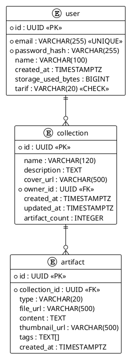

# Модель данных

## Концептуальная модель

Сущности и связи:

- **Пользователь** (1) ---- (M) **Коллекция** – один пользователь создаёт много коллекций.
- **Коллекция** (1) ---- (M) **Артефакт** – одна коллекция содержит много артефактов.
- **Артефакт** (M) ---- (N) **Тег** – многие-ко-многим, через промежуточную таблицу с атрибутом `assigned_at`.

## Логическая модель

- `user(id, email, password_hash, name, created_at, storage_used_bytes, tarif)`
- `collection(id, name, description, cover_url, owner_id -> user.id, created_at, updated_at, artifact_count)`
- `artifact(id, collection_id -> collection.id, type, file_url, content, thumbnail_url, tags[], created_at)`
- `tag(id, name UNIQUE)`
- `artifact_tag(artifact_id, tag_id, assigned_at)` – реализует M:N.

Ограничения: NOT NULL, UNIQUE для email и имени тега, CHECK для tarif.

## Физическая модель (PostgreSQL)

```sql
CREATE TABLE artifact_type (
    id SMALLINT PRIMARY KEY,
    name VARCHAR(20) UNIQUE
);

CREATE TABLE "user" (
    id UUID PRIMARY KEY,
    email VARCHAR(255) UNIQUE NOT NULL,
    password_hash VARCHAR(255) NOT NULL,
    name VARCHAR(100),
    created_at TIMESTAMPTZ NOT NULL DEFAULT NOW(),
    storage_used_bytes BIGINT NOT NULL DEFAULT 0,
    tarif VARCHAR(20) NOT NULL CHECK (tarif IN ('free', 'premium'))
);

CREATE TABLE collection (
    id UUID PRIMARY KEY,
    name VARCHAR(120) NOT NULL,
    description TEXT,
    cover_url VARCHAR(500),
    owner_id UUID NOT NULL REFERENCES "user"(id) ON DELETE CASCADE,
    created_at TIMESTAMPTZ NOT NULL DEFAULT NOW(),
    updated_at TIMESTAMPTZ NOT NULL DEFAULT NOW(),
    artifact_count INTEGER NOT NULL DEFAULT 0
);

CREATE TABLE artifact (
    id UUID PRIMARY KEY,
    collection_id UUID NOT NULL REFERENCES collection(id) ON DELETE CASCADE,
    type VARCHAR(20) NOT NULL CHECK (type IN ('image', 'text')),
    file_url VARCHAR(500),
    content TEXT,
    thumbnail_url VARCHAR(500),
    tags TEXT[],
    created_at TIMESTAMPTZ NOT NULL DEFAULT NOW()
);

CREATE TABLE tag (
    id UUID PRIMARY KEY,
    name VARCHAR(100) UNIQUE NOT NULL
);

CREATE TABLE artifact_tag (
    artifact_id UUID NOT NULL REFERENCES artifact(id) ON DELETE CASCADE,
    tag_id UUID NOT NULL REFERENCES tag(id) ON DELETE CASCADE,
    assigned_at TIMESTAMPTZ NOT NULL DEFAULT NOW(),
    PRIMARY KEY (artifact_id, tag_id)
);

-- Индексы
CREATE INDEX idx_collection_owner ON collection(owner_id);
CREATE INDEX idx_artifact_collection ON artifact(collection_id);
CREATE INDEX idx_artifact_tags ON artifact USING gin(tags);
```

## PlantUML диаграмма


